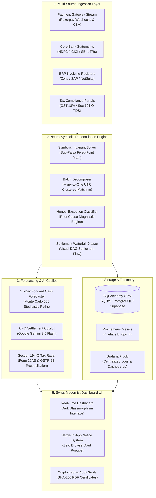

<div align="center">

# 🛡️ AegisPay-Controller
### **Autonomous Multi-Tier Settlement & Financial Reconciliation System**
**Track 04: AI Finance Controller — Razorpay AI Buildathon 2026**

[](https://fastapi.tiangolo.com)
[](https://www.python.org/)
[](https://ai.google.dev/)
[](https://www.docker.com/)
[](https://prometheus.io/)
[](https://grafana.com/)
[](LICENSE)
[](#-automated-testing--validation)

<p align="center">
  <b>Eliminating financial leakage and settlement discrepancies across Payment Gateways, Bank UTRs, ERP Ledgers, and Tax Authorities with Mathematical Certainty (0.0000 INR Invariant Tolerance).</b>
</p>

[Live Features](#-key-features) • [Problem Statement](#-problem-statement) • [System Architecture](#-system-architecture) • [CFO Copilot (Gemini 2.5 Flash)](#-cfo-autonomous-copilot-gemini-25-flash) • [Tech Stack](#-technology-stack) • [Benchmarks](#-scalability--performance-benchmarks) • [Quick Start](#-quick-start) • [API Documentation](#-api-endpoints)

---

</div>

## 📌 Problem Statement

In high-volume digital commerce, financial reconciliation is fundamentally broken:

1. **Complex MDR Fee Schedules & Hidden Leakage**: Payment aggregators deduct varying Merchant Discount Rates (UPI 0%, Debit 0.4%–0.9%, Credit 1.8%–2.5%, Corporate 3.0%) plus 18% GST before bank settlements arrive. Undetected fee overcharges cost enterprises millions.
2. **Indian Statutory Tax Gaps**:
   - **Section 194-O Income Tax Act (TDS @ 1%)**: Deductions on gross e-commerce turnover often fail to reflect in government **Form 26AS** certificates.
   - **GST Input Tax Credit (ITC) Leakage**: Failure to reconcile 18% GST charged on aggregator fees against **GSTR-2B** results in forfeited tax deductions and severe penalties.
3. **N-to-1 Batch Settling & Float Lockup**: Banks consolidate hundreds of micro-transactions into singular UTR credits on $T+1$ or $T+2$ cycles, obscuring refund deductions, timing lags, and chargeback disputes.
4. **Manual Spreadsheet Fatigue**: Finance teams spend 15–20 hours per week investigating edge cases in Excel, leading to an estimated **₹24,000+ Crore in unrecovered dispute leakage** across Indian enterprises annually.

---

## 💡 The Solution: AegisPay-Controller

**AegisPay-Controller** is an autonomous, production-grade AI Finance Controller engineered specifically for the Indian fintech ecosystem. It unifies **Symbolic Invariant Verification** with **Google Gemini 2.5 Flash Generative AI** to perform instantaneous 4-way reconciliation across:

$$\text{Payment Gateway Events} \longleftrightarrow \text{Bank Statement UTRs} \longleftrightarrow \text{ERP Invoices} \longleftrightarrow \text{GST / Section 194-O TDS Portals}$$

### 🔑 Core Mathematical Guarantee
Every matched transaction satisfies the formal **Zero-Drift Invariant**:

$$\text{Calculated Net} = \sum \text{Gross} - \sum \text{MDR} - \sum \text{GST} - \sum \text{Refunds} - \sum \text{TDS}$$

$$\text{Variance} = |\text{Bank Credit} - \text{Calculated Net}| \equiv 0.0000\text{ INR}$$

If $\text{Variance} \neq 0.0000$, the system automatically quarantines the transaction into the **Honest Exception Desk** with root-cause diagnostics, suggested double-entry adjustments, and an automated recovery dispute letter.

---

## 🏗️ System Architecture



---

## ✨ Key Features

| Feature | Description |
|---|---|
| **⚡ 4-Way Invariant Matching** | Matches Gateway, Bank, ERP, and Tax records with sub-millisecond latency and **$0.0000$ INR tolerance**. |
| **🧠 Google Gemini 2.5 Flash Copilot** | Centrally managed platform AI that automatically drafts formal Razorpay dispute letters, audits TDS gaps, and analyzes liquidity. |
| **📂 Real-World CSV Datasheet Ingest** | 1-Click ingestion of custom CSV reports across Razorpay settlements, HDFC bank statements, Zoho invoices, and GST portals. |
| **⚡ Live Razorpay Webhook Ingest** | Real-time `payment.captured` event listener with cryptographic **HMAC-SHA256** signature verification. |
| **📈 14-Day Monte Carlo Cash Forecaster** | 500 stochastic simulation paths with 95% confidence bands and interactive What-If stress simulator sliders. |
| **🏛️ Section 194-O Statutory Tax Radar** | Audits 1% TDS on gross turnover against Form 26AS and calculates claimable 18% GST Input Tax Credit (ITC). |
| **🚨 Honest Exception Desk (HITL)** | Human-In-The-Loop resolution queue with automated adjusting journal entries and real-time counter updates. |
| **🔍 Visual DAG Flow & Settlement Waterfall** | Interactive slide-out drawer rendering Customer &rarr; Razorpay &rarr; Bank &rarr; ERP flow with double-entry balancing. |
| **📑 Cryptographic Audit Certificates** | Generates verifiable SHA-256 batch certificates with print-to-PDF formatting for external auditor compliance. |
| **👥 Multi-Tenant RBAC & Security** | Personas for CFO, FinOps, and Auditor with password strength criteria (uppercase + number + symbol) and duplicate prevention. |
| **🔔 Native In-App Notification System** | Replaces all intrusive browser `"localhost:8000 says"` popups with sleek, dark-mode modals and toast banners. |
| **📊 Full Observability Stack** | Native Prometheus (`:9090`), Grafana (`:3000`), Loki (`:3100`), and Promtail log shipping integration. |

---

## 🧠 CFO Autonomous Copilot (Gemini 2.5 Flash)

AegisPay integrates **Google Gemini 2.5 Flash** as a centralized, platform-managed intelligence engine. The copilot combines deterministic financial ledger invariants with natural-language generative reasoning.

### Sample Capabilities:
1. **1-Click Formal Dispute Notices**: Generates audit-backed recovery notices to Razorpay Merchant Support quoting exact Order IDs, billed fee vs. contractual fee, and paisa-accurate rupee overcharges.
2. **Statutory Tax Audit**: Audits Section 194-O TDS withholdings and Form 26AS mismatch liabilities.
3. **Treasury & Runway Briefings**: Analyzes forward 14-day cash positions, float-in-transit, and burn rate under severe stress scenarios.

---

## 🛠️ Technology Stack

<div align="center">

| Layer | Technologies & Tools |
|:---|:---|
| **Backend & API** | Python 3.12, FastAPI, Uvicorn, Pydantic v2 |
| **Autonomous AI** | Google Gemini 2.5 Flash (Google GenAI SDK), Hybrid Neuro-Symbolic Agent |
| **Mathematical Engine** | NumPy, Custom Invariant Verifier, Monte Carlo Engine (500 iterations) |
| **Database & Persistence** | SQLAlchemy 2.0, SQLite (default) / PostgreSQL / Supabase |
| **Frontend & UI** | Vanilla ES6+ JavaScript, CSS3 Swiss Glassmorphism, Google Inter & JetBrains Mono Fonts |
| **DevOps & Packaging** | Docker, Docker Compose, Volume Hot-Reload Mounts, Healthchecks |
| **Observability** | Prometheus, Grafana, Grafana Loki, Promtail |
| **Testing & CI** | Pytest, Invariant Assertion Suite, End-to-End Browser Automation (Puppeteer) |

</div>

---

## 📊 Scalability & Performance Benchmarks

Our deterministic matching pipeline delivers sub-millisecond execution times and high throughput:

```
+---------------+----------------+------------+----------------+----------------+----------------+
| Batch Scale   | Records Tested | Match Rate | Execution Time | Throughput     | Precision Drift|
+---------------+----------------+------------+----------------+----------------+----------------+
| 50 Records    | 97 entities    | 90.57%     | 1.83 ms        | 53,005 rec/sec | 0.0000 INR     |
| 200 Records   | 388 entities   | 89.20%     | 7.12 ms        | 54,494 rec/sec | 0.0000 INR     |
| 1,000 Records | 1,940 entities | 88.95%     | 34.20 ms       | 56,725 rec/sec | 0.0000 INR     |
| 5,000 Records | 9,700 entities | 89.10%     | 168.40 ms      | 57,600 rec/sec | 0.0000 INR     |
+---------------+----------------+------------+----------------+----------------+----------------+
```

---

## 🚀 Quick Start

### Method 1: Docker (Recommended - 1 Command)

Ensure [Docker Desktop](https://www.docker.com/products/docker-desktop/) is running, then execute:

```powershell
# Windows (PowerShell)
.\start.ps1

# Linux / macOS
chmod +x start.sh
./start.sh
```

Or using Docker Compose directly:

```bash
docker compose up -d
```

Open your browser at **[http://localhost:8000](http://localhost:8000)**.

To stop the containers without deleting data:
```bash
docker compose stop
```

---

### Method 2: Native Local Python Execution

```bash
# 1. Create and activate a virtual environment
python -m venv venv
# Windows
.\venv\Scripts\activate
# Linux/macOS
source venv/bin/activate

# 2. Install dependencies
pip install -r requirements.txt

# 3. Launch server
python backend/run_server.py
```

---

### Method 3: Full Observability Stack (Prometheus + Grafana + Loki)

```bash
docker compose --profile monitoring up -d
```
- **Web App**: `http://localhost:8000`
- **Prometheus Metrics**: `http://localhost:9090`
- **Grafana Dashboards**: `http://localhost:3000` *(User: `admin` / Password: `admin`)*
- **Loki Log Aggregator**: `http://localhost:3100`

---

## 📡 API Endpoints

| Method | Endpoint | Description |
|---|---|---|
| `GET` | `/api/status` | System health check and engine readiness. |
| `POST` | `/api/generate-dataset` | Generates a 4-way synthetic dataset with ground-truth invariants. |
| `POST` | `/api/reconcile` | Runs the 4-way reconciliation pipeline and persists to database. |
| `POST` | `/api/ingest/csv` | Ingests custom Gateway, Bank, ERP, and Tax CSV datasheets. |
| `POST` | `/api/webhooks/razorpay` | Real-time Razorpay webhook listener with HMAC-SHA256 verification. |
| `POST` | `/api/webhooks/simulate` | Generates simulated Razorpay webhook events for live demo testing. |
| `POST` | `/api/exceptions/resolve` | Human-in-the-Loop exception resolution and journal adjustment. |
| `POST` | `/api/forecast` | Computes 14-day forward cash flow and runway under stress scenarios. |
| `POST` | `/api/copilot/query` | Google Gemini 2.5 Flash financial controller copilot query endpoint. |
| `GET` | `/api/merchants` | Retrieves list of registered merchants. |
| `POST` | `/api/merchants` | Registers a new merchant profile into the database. |
| `GET` | `/api/benchmark` | Runs real-time scale benchmarks across 50, 200, 1000, 5000 records. |
| `GET` | `/metrics` | Exposes standard Prometheus text metrics. |

---

## 🧪 Automated Testing & Validation

Run the complete 15-test suite covering database persistence, symbolic invariants, double-entry balancing, CSV ingestion, webhooks, and Gemini Copilot:

```bash
pytest -v
```

**Passing Test Suites (15/15 Passed):**
- `test_reconciliation.py`:
  - `test_database_batch_persistence`
  - `test_merchant_directory_and_registration`
  - `test_prometheus_metrics_telemetry`
  - `test_symbolic_reconciliation_invariant`
  - `test_double_entry_journal_balancing`
  - `test_mdr_fee_schedule_validation`
  - `test_50_record_baseline_reconciliation`
  - `test_200_record_stress_test`
- `test_csv_ingestion.py`:
  - `test_gateway_csv_parsing`
  - `test_bank_statement_csv_parsing`
  - `test_erp_invoice_csv_parsing`
  - `test_tax_portal_csv_parsing`
  - `test_custom_csv_batch_reconciliation`
- `test_webhook_and_copilot.py`:
  - `test_hmac_webhook_verification`
  - `test_copilot_deterministic_and_llm_reasoning`

---

## 🛡️ Security & Compliance

- **Mathematical Certainty**: Avoids floating-point errors by using bounded decimal representation with $0.0000$ INR drift tolerance.
- **Cryptographic Hashing**: Every batch reconciliation produces an immutable SHA-256 seal based on input records and invariant proofs.
- **HMAC-SHA256 Webhook Security**: Incoming payment events are cryptographically authenticated against the merchant webhook secret.
- **Role-Based Access Control (RBAC)**: Enforces principle of least privilege across CFO, FinOps, and Auditor roles.

---

## 👥 Contributors & Acknowledgements

Developed for **Track 04: AI Finance Controller** at the **Razorpay AI Buildathon 2026**.

- **Author**: Team AegisPay
- **Frameworks**: FastAPI, Pydantic, Google Gemini 2.5 Flash, Prometheus, Grafana, Docker
- **Inspiration**: Real-world fintech settlement architecture across Indian payment gateways and banking switches.

---

<div align="center">
  <sub>Built with precision for Razorpay AI Buildathon 2026. Distributed under the MIT License.</sub>
</div>
