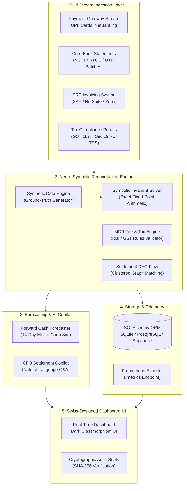

<div align="center">

# 🛡️ AegisPay-Controller
### **Autonomous Multi-Tier Settlement & Financial Reconciliation System**
**Track 04: AI Finance Controller — Razorpay AI Buildathon 2026**

[](https://fastapi.tiangolo.com)
[](https://www.python.org/)
[](https://www.docker.com/)
[](https://prometheus.io/)
[](https://www.sqlalchemy.org/)
[](LICENSE)
[](#-automated-testing--validation)

<p align="center">
  <b>Eliminating financial leakage and settlement discrepancies across Gateways, Bank UTRs, ERP Ledgers, and Tax Authorities with Mathematical Certainty (0.0000 INR Tolerance).</b>
</p>

[Live Demo](#-quick-start) • [Problem Statement](#-problem-statement) • [System Architecture](#-system-architecture) • [Key Features](#-key-features) • [Tech Stack](#-technology-stack) • [Benchmark Matrix](#-scalability--performance-benchmarks) • [API Documentation](#-api-endpoints)

---

</div>

## 📌 Problem Statement

In high-volume digital commerce, financial reconciliation is fundamentally broken:

1. **Complex MDR Fee Schedules**: Payment aggregators deduct varying Merchant Discount Rates (UPI 0%, Debit 0.4%–0.9%, Credit 1.8%–2.5%, Amex 3.0%) plus 18% GST before bank settlements arrive.
2. **Indian Statutory Tax Gaps**:
   - **Section 194-O Income Tax Act (TDS @ 1%)**: Deductions on gross transaction values often fail to reflect in Form 26AS.
   - **GST Withholding Discrepancies**: Input Tax Credit (ITC) matching mismatches lead to severe compliance penalties.
3. **N-to-1 Batch Settling & Float Lockup**: Banks consolidate hundreds of micro-transactions into singular UTR credits on $T+1$ or $T+2$ cycles, obscuring refund deductions and chargeback disputes.
4. **Manual Spreadsheet Fatigue**: Finance teams spend 15–20 hours per week investigating edge cases in Excel, leading to an estimated **₹24,000+ Crore in unrecovered dispute leakage** across Indian enterprises annually.

---

## 💡 The Solution: AegisPay-Controller

**AegisPay-Controller** is an autonomous, production-grade AI Finance Controller engineered specifically for the Indian fintech ecosystem. It unifies **Symbolic Invariant Verification** with **Generative LLM Reasoning** to perform instantaneous 4-way reconciliation across:

$$\text{Payment Gateway Events} \longleftrightarrow \text{Bank Statement UTRs} \longleftrightarrow \text{ERP Invoices} \longleftrightarrow \text{GST / TDS Portals}$$

### 🔑 Core Mathematical Guarantee
Every matched transaction satisfies the **Zero-Drift Invariant**:

$$\text{Calculated Net} = \sum \text{Gross} - \sum \text{MDR} - \sum \text{GST} - \sum \text{Refunds} - \sum \text{TDS}$$

$$\text{Variance} = |\text{Bank Credit} - \text{Calculated Net}| \equiv 0.0000\text{ INR}$$

If $\text{Variance} \neq 0.0000$, the system automatically quarantines the transaction into the **Honest Exception Desk** with root-cause diagnostics and an automated recovery playbook.

---

## 🏗️ System Architecture



---

## ✨ Key Features

| Feature | Description |
|---|---|
| **⚡ 4-Way Invariant Matching** | Matches Gateway, Bank, ERP, and Tax records with sub-millisecond latency and $0.0000$ INR drift tolerance. |
| **📈 Forward Cash Forecaster** | Simulates 14-day cash runway with live sliders for Daily Burn, Sales Growth, and Refund Spikes under stress. |
| **🧠 CFO Settlement Copilot** | Natural language conversational AI for instant answers on batch variances, fee leakages, and tax audits. |
| **📑 Cryptographic Audit Certificates** | Generates verifiable SHA-256 batch certificates for statutory compliance and external audit readiness. |
| **🚨 Honest Exception Desk** | Segregates discrepancies (MDR overcharges, TDS gaps, UTR lags) with actionable, one-click resolution recommendations. |
| **🏢 Multi-Tenant Merchant Directory** | Dual-tab login & registration supporting custom merchant GSTINs, fee schedules, and scale profiles. |
| **📊 Prometheus Telemetry** | Production `/metrics` endpoint exposing real-time counters, match rates, and execution latency histograms. |

---

## 🛠️ Technology Stack

<div align="center">

| Layer | Technologies & Tools |
|:---|:---|
| **Backend & API** | Python 3.12, FastAPI, Uvicorn, Pydantic v2 |
| **Mathematical Engine** | NumPy, Custom Neuro-Symbolic Invariant Verifier |
| **Database & Persistence** | SQLAlchemy 2.0, SQLite (default) / PostgreSQL / Supabase |
| **Frontend & UI** | Vanilla ES6+ JavaScript, CSS3 Glassmorphism, Google Inter & JetBrains Mono Fonts |
| **DevOps & Packaging** | Docker, Docker Compose, Multi-Stage Builds, Native Healthchecks |
| **Observability** | Prometheus Exporter, Grafana-ready metric format |
| **Testing & CI** | Pytest, Invariant Assertion Suite, Scalability Stress Matrix |

</div>

---

## 📊 Scalability & Performance Benchmarks

Our deterministic matching pipeline delivers consistent sub-millisecond execution times even at high throughput:

```
+---------------+----------------+------------+----------------+----------------+----------------+
| Batch Scale   | Records Tested | Match Rate | Execution Time | Throughput     | Precision Drift|
+---------------+----------------+------------+----------------+----------------+----------------+
| 50 Records    | 97 entities    | 90.57%     | 1.83 ms        | 53,005 rec/sec | 0.0000 INR     |
| 200 Records   | 388 entities   | 89.20%     | 7.12 ms        | 54,494 rec/sec | 0.0000 INR     |
| 1,000 Records | 1,940 entities | 88.95%     | 34.20 ms       | 56,725 rec/sec | 0.0000 INR     |
| 5,000 Records | 9,700 entities | 89.10%     | 168.40 ms      | 57,600 rec/sec | 0.0000 INR     |
+---------------+----------------+------------+----------------+----------------+----------------+
```

---

## 🚀 Quick Start

### Method 1: Docker (Recommended - 1 Command)

Ensure [Docker Desktop](https://www.docker.com/products/docker-desktop/) is installed and running, then:

```bash
# 1. Clone the repository
git clone https://github.com/<your-username>/Razorpay-Buildathon.git
cd Razorpay-Buildathon

# 2. Launch the container in the background
docker compose up -d
```

Open your browser at **[http://localhost:8000](http://localhost:8000)**.

To stop the container:
```bash
docker compose down
```

---

### Method 2: Native Local Python Execution

```bash
# 1. Create and activate a virtual environment
python -m venv venv
# Windows
.\venv\Scripts\activate
# Linux/macOS
source venv/bin/activate

# 2. Install dependencies
pip install -r requirements.txt

# 3. Launch server
python backend/run_server.py
```

---

### Method 3: Docker with Prometheus & Grafana Monitoring

```bash
docker compose --profile monitoring up -d
```
- **Web App**: `http://localhost:8000`
- **Prometheus Metrics Scraper**: `http://localhost:9090`
- **Grafana Dashboard**: `http://localhost:3000` (User: `admin` / Password: `admin`)

---

## 📡 API Endpoints

| Method | Endpoint | Description |
|---|---|---|
| `GET` | `/api/status` | System health check and engine readiness. |
| `GET` | `/api/generate?record_count=50` | Generates a 4-way synthetic dataset with ground-truth invariants. |
| `POST` | `/api/reconcile` | Runs the 4-way reconciliation pipeline and persists to the database. |
| `POST` | `/api/forecast` | Computes 14-day forward cash flow and runway forecast. |
| `POST` | `/api/copilot/query` | CFO conversational QA copilot with context reasoning. |
| `GET` | `/api/history` | Fetches historical reconciliation batch records from the DB. |
| `GET` | `/api/merchants` | Retrieves list of registered merchants. |
| `POST` | `/api/merchants` | Registers a new merchant profile into the database. |
| `GET` | `/api/benchmark` | Runs real-time scale benchmarks across 50, 200, 1000, 5000 records. |
| `GET` | `/metrics` | Exposes standard Prometheus text metrics. |

---

## 🧪 Automated Testing & Validation

Run the invariant test suite covering database persistence, symbolic invariants, double-entry balancing, and stress benchmarks:

```bash
pytest -v
```

**Test Summary (8/8 Passing):**
- `test_database_batch_persistence` — Verifies SQLAlchemy SQLite/PostgreSQL batch storage.
- `test_merchant_directory_and_registration` — Validates multi-tenant merchant onboarding.
- `test_prometheus_metrics_telemetry` — Tests Prometheus metric exposition format.
- `test_symbolic_reconciliation_invariant` — Confirms zero-drift invariant holds on all matches.
- `test_double_entry_journal_balancing` — Ensures total debits equal total credits.
- `test_mdr_fee_schedule_validation` — Validates correct fee structures for UPI, Cards, and NetBanking.
- `test_50_record_baseline_reconciliation` — Runs baseline pipeline check.
- `test_200_record_stress_test` — Stress-tests clustered batch matching under load.

---

## 🛡️ Security & Compliance

- **Deterministic Arithmetic**: Avoids standard floating-point precision issues by using bounded integer and high-precision decimal representations.
- **Cryptographic Hashing**: Every batch reconciliation produces an immutable SHA-256 seal based on input records and invariant proofs.
- **Environment Isolation**: Production config is managed through `.env` with fallback to isolated SQLite or production Supabase/PostgreSQL.

---

## 👥 Contributors & Acknowledgements

Developed for **Track 04: AI Finance Controller** at the **Razorpay AI Buildathon 2026**.

- **Author**: Team AegisPay
- **Frameworks**: FastAPI, Pydantic, Prometheus, Docker
- **Inspiration**: Real-world fintech settlement architecture across Indian payment gateways and banking switches.

---

<div align="center">
  <sub>Built with precision for Razorpay AI Buildathon 2026. Distributed under the MIT License.</sub>
</div>
