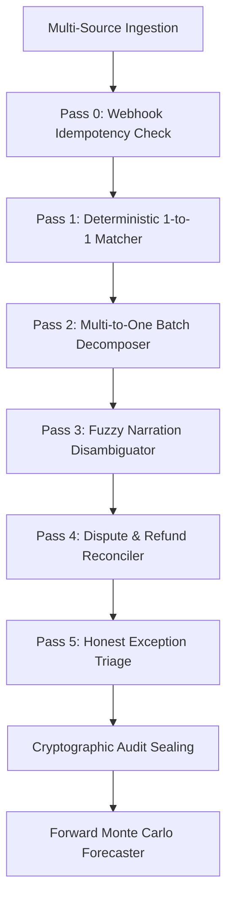

# Technical Architecture Whitepaper
## AegisPay-Controller: Dual-Loop Neuro-Symbolic Financial Operations Engine
**Track 04: AI Finance Controller (Razorpay AI Buildathon 2026)**

---

## 1. Mathematical Formulation & Invariants

At the core of AegisPay-Controller is the **FinTech Settlement Equation**, which must hold true across all asynchronous records in a closed finance-ops loop:

$$\text{Net Bank Credit} = \sum_{i=1}^n \text{Gross}_i - \sum_{i=1}^n \text{MDR}_i - \sum_{i=1}^n \text{GST}_{\text{MDR}, i} - \sum_{j=1}^m \text{Refund}_j - \sum_{k=1}^p \text{Chargeback}_k - \sum_{l=1}^q \text{TDS}_{194O, l} \pm \Delta_{\text{Reserve}}$$

### 1.1 Invariant Verification Constraints
For any candidate match bundle $\mathcal{B} = \{\mathcal{G}, \mathcal{K}, \mathcal{E}, \mathcal{T}\}$:
1. **Numerical Drift Tolerance**:
   $$|\text{Calculated Net}(\mathcal{G}, \mathcal{T}) - \text{Bank Credit}(\mathcal{K})| \le \epsilon = ₹0.01$$
2. **Double-Entry Balance Constraint**:
   $$\sum \text{Debits} \equiv \sum \text{Credits}$$
3. **Cryptographic Proof Seal**:
   $$\text{Seal} = \text{SHA256}\left(\text{JSON}(\text{OrderIDs}, \text{UTRs}, \text{Amounts}, \text{ProofResidual})\right)$$

---

## 2. Multi-Pass Neuro-Symbolic Pipeline

### Pass Breakdown:
- **Pass 0**: Checks for duplicate `payment.captured` webhooks and filters redundant replays while maintaining a single bank settlement record.
- **Pass 1**: Exact matching on order ID, UTR narration, and net amounts. Formally validates MDR fee schedules against contractual interchange cards (0% UPI, 0.9% Debit, 1.8% Domestic Credit, 2.8% International Credit).
- **Pass 2**: Decomposes aggregated bank batch deposits (`setl_batch_xxx`) into constituent line-item orders and proves aggregated balance invariance.
- **Pass 3**: Employs fuzzy sequence matching and entity normalization to link truncated bank narrations (e.g. `UPI/CR/948201928401/S. SHARMA/RZP-PAY/order_1045`) to customer records, accepting them only after formal mathematical proof verification.
- **Pass 4**: Reconciles partial customer refunds and dispute clawbacks against adjusted bank credits.
- **Pass 5 (Honest Exception Triage)**: Classifies all remaining un-reconciled items into structured root causes with proposed adjusting journal entries for CFO approval.

---

## 3. Forward Cash & Liquidity Monte Carlo Simulation

The forward cash forecaster simulates treasury liquidity over $H$ days ($H \in \{7, 14, 30\}$):

$$C(t) = C(t-1) + \mathbb{E}[I(t)] - \mathbb{E}[O(t)] - R(t)$$

Where:
- $I(t) \sim \mathcal{N}(\mu_{\text{inflow}} \cdot S(t), \sigma_{\text{inflow}}^2)$: Daily payment inflows scaled by settlement day multiplier $S(t)$ ($S(t)=0.20$ on weekends, $1.40$ on Mondays).
- $O(t) \sim \mathcal{N}(\mu_{\text{burn}}, \sigma_{\text{burn}}^2)$: Daily operational outflows and vendor payouts.
- $R(t) = 0.05 \cdot I(t)$: 5% Rolling Reserve buffer for chargebacks.
- Confidence intervals are computed across 500 Monte Carlo trajectories with 95% confidence bounds ($\pm 1.96 \frac{\sigma}{\sqrt{N}}$).

---

## 4. Honest Exception Taxonomy

| Root Cause | Severity | Financial Exposure | Recommended Protocol |
| :--- | :--- | :--- | :--- |
| `MDR_RATE_DISCREPANCY` | Medium | Fee Delta ($\Delta_{\text{fee}}$) | Raise automated dispute ticket with Razorpay Merchant Operations. |
| `BANK_TIMING_LAG_T_PLUS_N` | Low | Net Due Amount | Monitor next clearing cycle feed ($T+2$). |
| `UNMATCHED_CHARGEBACK_CLAWBACK` | High | Clawback Debit | Cross-reference bank chargeback reference with customer dispute portal. |
| `GST_TDS_WITHHOLDING_GAP` | Medium | 1% Sec 194-O TDS | Post adjusting subledger entry to claim TDS credit against GSTR / 26AS. |
| `DUPLICATE_GATEWAY_WEBHOOK` | Low | Gross Volume | De-duplicate webhook in idempotent log. Discard replay. |
| `UNCLAIMED_BANK_CREDIT` | High | Credit Amount | Place funds in 2190 - Suspense Clearing Account. |
